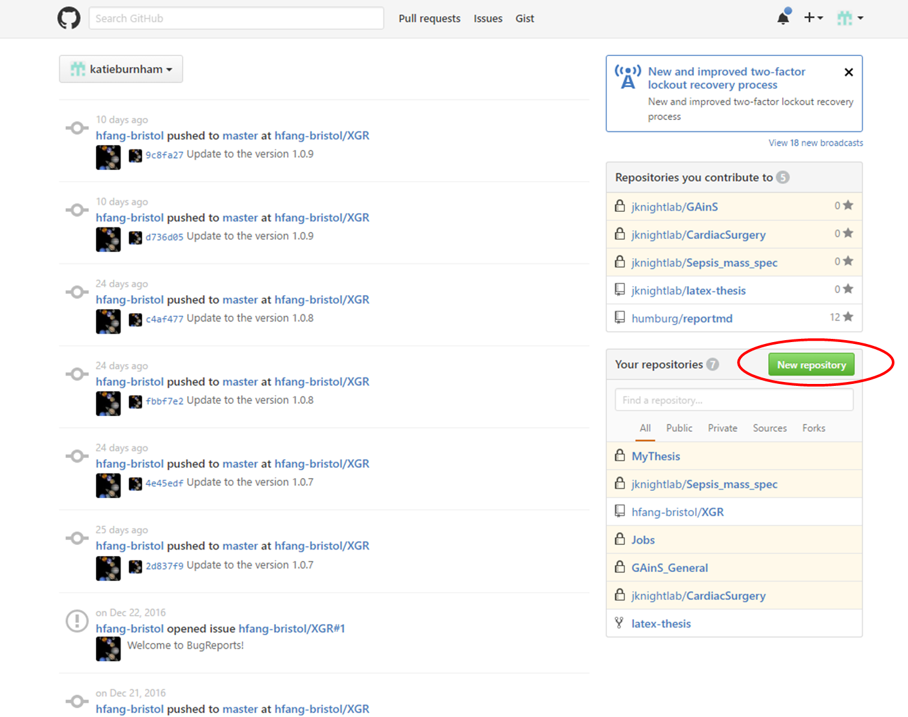
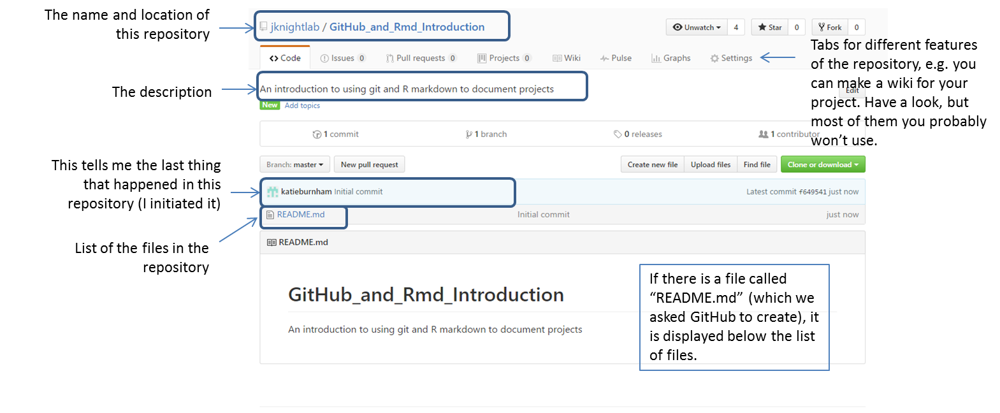
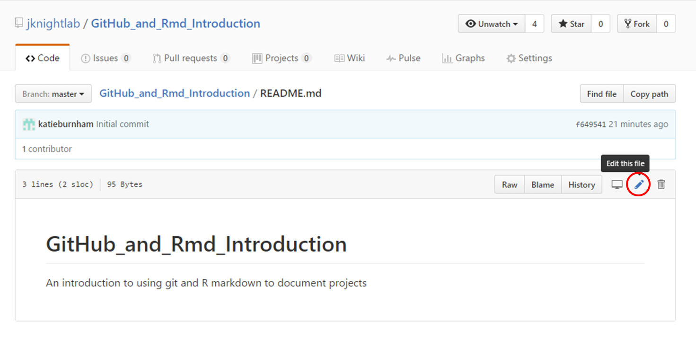
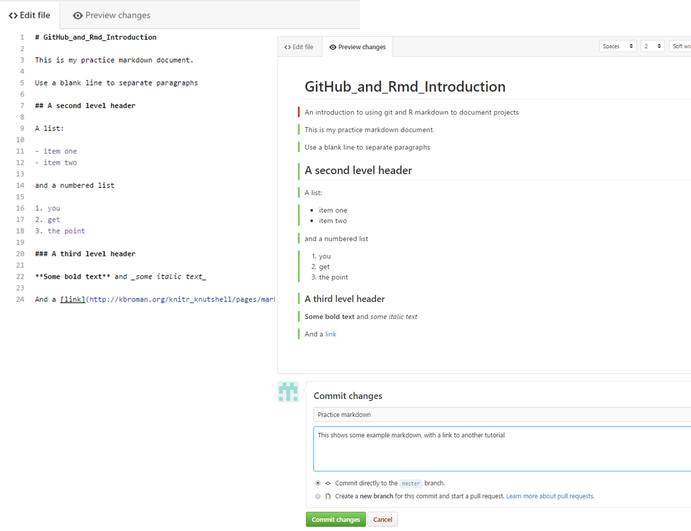
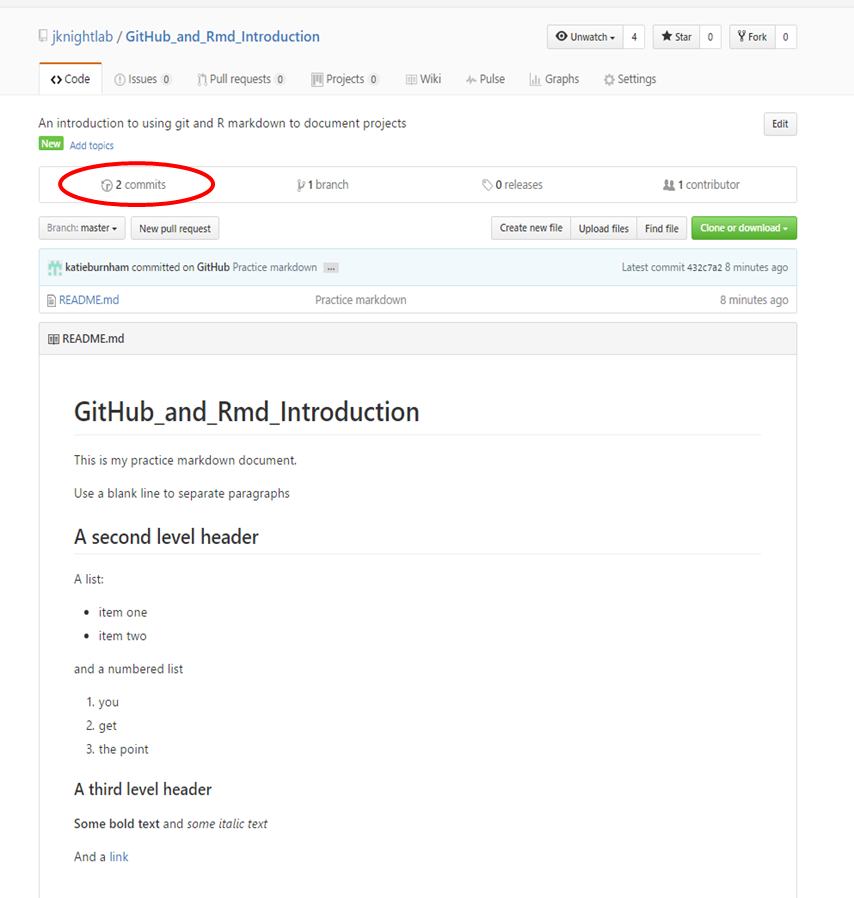
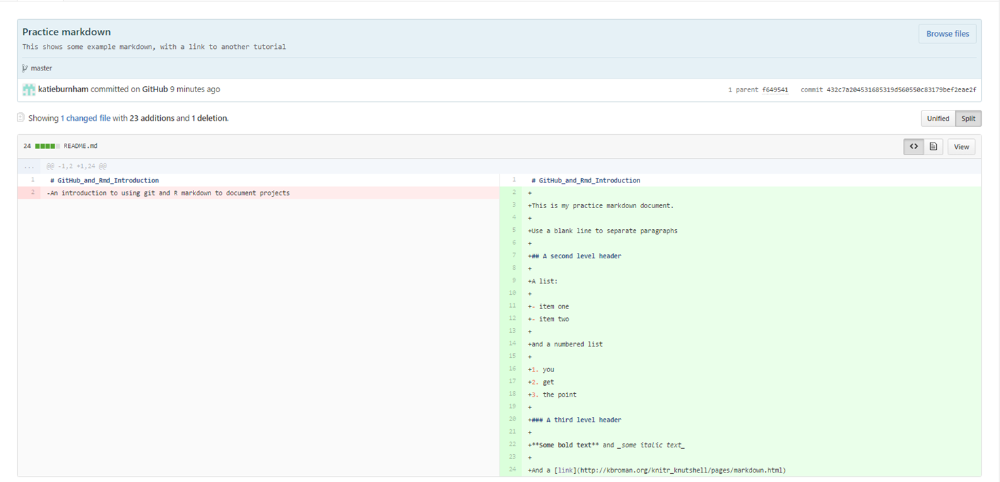
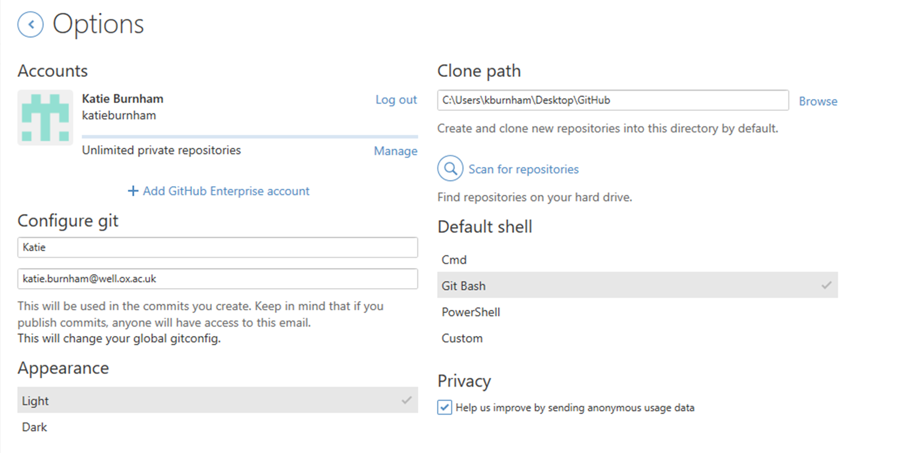
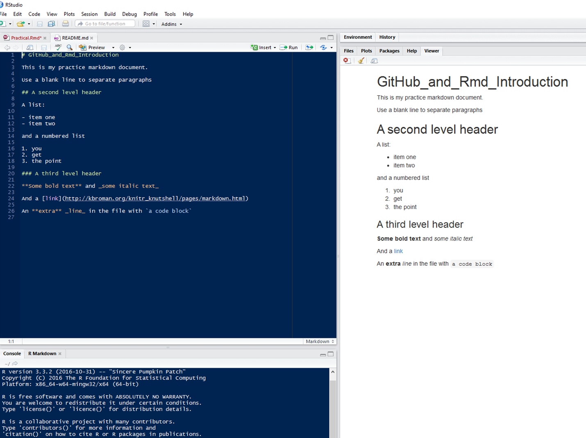
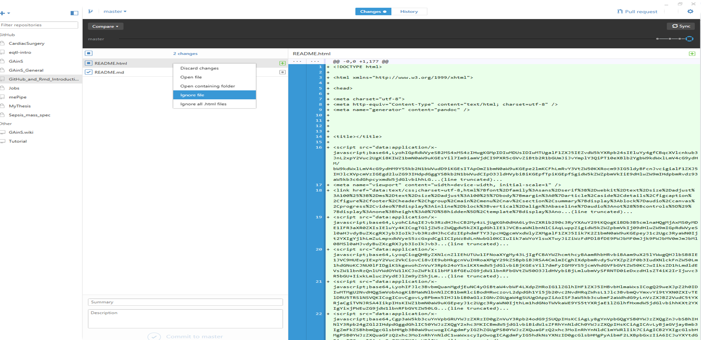

# Git Practice
Katie Burnham  
9 February 2017  


In this practical, you will make a GitHub repository, edit a markdown text file,
and track changes in this document using Git. You can do this using
a desktop interface for Git, and/or the command line; instructions for both are 
given. 

## What is a GitHub repository?

A **repository** is essentially the same as a directory: a folder, containing 
your files for one project. It is not limited to code; it can also store images,
text files, etc. The idea is that, a bit like Dropbox, there will be a copy of 
this folder on the GitHub website, which can be copied to multiple different
computers. The big plus is that Git was designed for **version control**, 
keeping "snapshots" of each point in your repository's history without you 
having to have 20 different copies of each file. This allows you to look back 
or return to previous versions. 

As a member of the jknightlab GitHub group, you can have repositories under your
account that only you can see, as well as repositories associated with the lab 
account that everyone can access. For example, I have personal repositories for 
my thesis and for odds and ends that don't go anywhere else, and in the 
jknightlab group I use the "GAiNS" and "CardiacSurgery" repositories. All of 
these are synced to my work computer and my laptop, and other people on the GAinS
project can also have copies. These can also be public or private repositories,
controlling whether people outside the group can see them. 

This is the other reason to use Git: it's a bit like a shared electronic lab 
book. I have a record of everything computer-based that I've tracked with Git 
that I can look back to, other people (current and future) on the project can
look at this, and if anyone in the group wants to use similar approaches on 
different datasets, they can access my notes easily. This is not limited to 
code; there should be at least descriptions of different datasets, how they were
generated, and where the data is stored. If you look quickly at the
[GAinS](https://github.com/jknightlab/GAinS) repository, you can see 5 different
people have contributed to it, documenting the different aspects of the project.
This might look like a lot of work, but it wasn't all done at once. Using Git
probably adds about 5 minutes' work to my day, and in the long run has saved a 
huge amount of time and effort. 

## Creating a GitHub respository

1. Open a web browser and go to [the GitHub website](https://github.com/)

2. Sign in and you should see something like this:



3. Click on the green "New repository" button under "Your repositories"

4. Fill in the details: if you want you can make a repository that you will
continue to use, or just call it "Git_Practice" and delete it at the end. Select
your username as the owner (unless you are making a repository for a lab project
not already included in the lab account).

5. Tick "initialize this repository with a README" and click "Create repository"


6. You will now be taken to the home page for your new repository. This shows
you all the files in your folder (currently just a README), and allows you to 
edit them directly. Have a look around; there are a LOT of options and you can do
a lot of things that are beyond the scope of this introduction.



## Editing files on GitHub

1. Click on "README.md" in the file list. This will open the README file (the 
page will look pretty similar as it is the only file in your repository at the
moment)

2. To edit the file, click the pencil symbol at the top right. 



3. You now have this file open in a web text editor. It is a markdown file, so
the formatting is controlled using markdown tags (e.g. # for a header, ** for
bold text). Markdown is used across GitHub for formatting text (technically,
GitHub Flavored Markdown, so with a few minor differences). This means that
markdown files are displayed as much nicer looking web pages. Make some changes
(e.g. see below), and use the "Preview changes" tab to see the output rendered as
a web page. You can see that anything you have added to the file will have a
green bar next to it, and anything you have deleted a red bar. 

```
# GitHub_and_Rmd_Introduction

This is my practice markdown document.

Use a blank line to separate paragraphs

## A second level header

A list:

- item one
- item two

and a numbered list

1. you
2. get
3. the point

### A third level header

**Some bold text** and _some italic text_

And a [link](http://kbroman.org/knitr_knutshell/pages/markdown.html)
```



4. **Commit** your changes. This is a fancy (quicker) way of saying "save the 
file, but remember what has been changed from the previous version". Give the 
commit a short, descriptive name so that if you ever want to find or revert to a
previous version of your file, you can identify it easily. You can also add a
longer, optional description to keep track of what you are doing.

5. If you navigate back to the repository home by clicking on its name at the
top of the page, you will see that your commit is now logged and the README
displayed has been updated. First, click on the clock with "2 commits" next to it
underneath the repository description. This shows you the history of your
changes. Click on the name of the latest commit, and you will see the old and new
versions of your file side by side (**diff** view - you can also have a unified
view, which is more like Word track changes). 







## Cloning a repository to your local computer

The GitHub website has a lot of great features, but really what you want is to 
edit your files as normal on your computer, and then update the repository on 
GitHub with your changes. To do this, you first need a local copy, or **clone**,
of your repo.

GitHub Desktop is a GUI (graphical user interface) for the Git software, which 
was originally just used through the command line. You can now do the same things
in this programme, with the benefit of it being easier to see what is happening.
When you download GitHub Desktop, it installs Git on your computer, so you can
also use it without the GUI. Another way to use Git (which I have very limited
experience with) is called GitKraken - you might find you prefer this. The
screenshots are from the Windows version, but I've noted where the Mac version
looks different. 

(If you want to try both the GUI and command line approaches, you can delete and 
reclone your repo, and make another small change to your document to commit.)

### Using GitHub Desktop (recommended at first to visualise what is happening)

1. Open GitHub Desktop 

2. If you haven't used this before, you will have to configure Git i.e. tell it
your login details so it can sync with GitHub. Click on the settings button on 
the top right and select Options. I have mine set up as below.


3. Click on the plus symbol on the top left of the window. First, we we clone 
the repository we have been using so far from GitHub. Click the Clone tab, find 
your repository, and clone it. Choose where you want to copy it to on your
computer, and it will be copied there. Navigate to it in Windows Explorer/Finder
and open the folder, and you will find the README file you made earlier.


4. In GitHub desktop, click on your repository in the list on the left hand side,
and you will see its history as tracked by Git. Along the top is a time line,
with each circle representing a commit you have made. Click on a circle, and the
details will be shown. If you wanted to have multiple parallel versions of your
files, you could **branch** your repository. As we are not bothered about this
for now, you just have one branch, the **master** branch. The changes tab
currently tells you that you have 0 changes, because the local copy of your
repository matches the online version. Clicking on the history tab brings up a
detailed record of the changes you have made.

### Doing the same thing in a shell

1. Open Git Bash/Terminal/sign into Galahad

2. If you haven't used this before, you will have to configure Git i.e. tell it
your login details so it can sync with GitHub. To do this, use 

```
git config --global user.name "Your Name Here"

git config --global user.email "your_email@well.ox.ac.uk"

```

3. Navigate to where you want to clone your repository to (`cd /MyPath`)


4. On GitHub, click "Clone or download" under your repository name on the main 
page of your repository. In the clone with HTTPs section, click the clipboard
icon to copy the clone URL. Paste it into the command below, and your repo will
be cloned to your local computer. Use `ls` to see the README.md file that you 
made.

```
git clone https://github.com/jknightlab/GitHub_and_Rmd_Introduction.git
```

5. To review the history of your repository, use `git log`. To look in detail at
a particular commit, use `git show [commit]`

If you carry on using the command line, you can set it up so that you don't have
to enter your user name and password every time. 

## Editing R Markdown files

1. Open your README.md file in RStudio (the second half of this tutorial will go
into R Markdown in more detail). The markdown should be displayed in the top left
panel, which is your text editor. 

2. Make a small change to your README file, e.g.

```
An **extra** _line_ in the file with `a code block`
```

3. Click the Preview button to see the updated output, as before.



## Committing Changes

### With GitHub Desktop

1. This change has been saved in the local copy of our file. Your Git software 
will have also noticed that the file has been changed. If you return to GitHub
Desktop, you will see a dot has appeared on the Changes tab, indicating that 
you have some changes that have not been committed. Unsurprisingly, your 
README.md file has been edited, and you can see the **diff** view of this as on
the GitHub website. Should you decide that you don't want these changes after 
all, right click on the file name and select "Discard changes". 

You will also see that a file called README.html has appeared. RStudio created
this when you previewed your markdown file, and this is really the output of a
markdown document. If you look in the folder, you will find this file, and you
can open it and look at it in your web browser. 

2. The html file is nice to look at, but I generally don't want to synchronise
it. I can regenerate it from the markdown file and GitHub will render it
automatically. Therefore, we will only commit the changes to the markdown file.
We could just untick it in the list before making the commit, but we actually
want Git not to pay attention to it from now on. Therefore, we are going to
**ignore** it. Right click on the html file in the list of changes, and select
"Ignore file". It will be replaced in the list by a new change, called
.gitignore. This is a hidden file that you have just created, which lists all the
files that you don't want git to track. This can be types of file as well as
individual files - and don't worry, you can edit this in the future. 



3. As on the website, fill in a commit summary and description at the bottom of
the window. It is probably better practice to do the edit and the ignore as two
separate commits as they are unrelated changes. I try to have each commit I do a
distinct task, which could involve editing multiple different files but all with 
the same goal in mind.

4. Click "Commit to master". The changes will vanish from the "Changes" tab, and
the commit is added to the "History" tab.

5. We have now changed our minds about the change we made and want to **revert** 
to the former version. It is not possible to undo a commit on GitHub (well, you 
can just edit the file again of course) but on your computer you can return to a
previous version of your files. To do this, click on the commit with the minor
edit of your README file, and click "Revert" on the top right. You will see that
this creates another commit, so everything is tracked - you can go back and 
forth as much as you want. 

### Doing the same thing in a shell

1. Use `git status` to see what files have been changed in your local repository.
Use `git diff` to see the changes.

2. The equivalent of ticking the files you want to add to a commit is `git add [file name]`. To ignore a file, create a file called ".gitignore" and add the
file name to it (e.g. use vim)

```
vim .gitignore
Shift + i

*.html

ESC
:wq
```

3. To make a commit, use `git commit -m [descriptive message]. All the changes
that you have **staged** using `add` will be in this commit. 

4. You have now committed these changes locally. Use `git status` again to check
this.

5. To undo this commit, use `git reset [commit]`. This reverts all commits after
the commit named in the command.

## Pushing changes to GitHub

Finally, we want to upload our local changes to GitHub. This is called
**pushing**. With GitHub Desktop, this is done by pressing the "Sync" button.
Your local repository is now synchronised with your online one. Navigate there to
check this. If you or someone else then wants to work on a copy of these files on
another computer, they can clone the repository as we did earlier.

With the command line, use `git push`. You might get warnings, because you have
not specified branches (we only have one, but to be more precise you can use 
`git push origin master`. Origin is the online version, master is your local 
branch). To download changes from GitHub, use `git pull`.

## Troubleshooting merge conflicts

**Pull**, as you might imagine, does download changes to your repository from
GitHub. _HOWEVER_, this can occasionally cause problems, as this process also
involves merging those changes with any changes you have made locally. Behind the
scenes, **pull** is actually a combination of two separate tasks: **fetch**
(downloading changes from GitHub to a local branch) and **merge** (merging them
to your local master branch). 

GitHub Desktop only has a "Sync" button, which simultaneously pushes
and pulls changes. In some ways this is simpler, as with what we have done so
far this will work just fine. It is also fine most of the time when you are the
only person working on a file (which is mostly how I use GitHub - I have shared 
repositories, but we generally don't edit the same file). The only time I've had
issues with this is when I've edited a file on my laptop, and uploaded the 
changes to GitHub. I've then edited the same file on my desktop without first
pulling these changes. When I try to upload _those_ changes, Git 
understandably doesn't know how to combine them, and doesn't want to mess up the 
online version, as that is the central copy. It will then tell me that I have
a **merge conflict**. It looks scary when this happens, but it is very easy to 
deal with. Git puts both sets of changes into my local file, surrounded by tags
telling me which sections are confusing. I can then edit this file so that it has
the changes I want, and once I've deleted the merge conflict tags, I can commit
the changes as normal. Obviously, I can avoid this by remembering to pull down
changes before I start working on the file...Git is very good at coping with
multiple changes to the same file but in different sections, as well. 

The same thing can happen when using the command line, but you have a bit more
control (though it looks more complicated). For example, if you try to use 
`git push` and get an error message because your local copy has diverged from the
central repository, you can use `git pull --rebase origin master`. This means
"pull the upstream changes first, then add all your local commits". If there is a
direct conflict, you will be told and can edit the file as above. 

If you want to practice dealing with this:

1. open your local README file and delete a word. 

2. Then go to the same file via GitHub, and delete a different word in the same
line. 

3. Commit both changes, 

4. and then press Sync in GitHub Desktop. 

5. You will get an error message, so click OK and go back to your file in RStudio to sort this out. 


You will see something like this:

```

<<<<<<< HEAD
This is my practice document.
=======
This is my markdown document.
>>>>>>> origin/master
```

6. Delete the line that you don't want to keep, and remove the lines that Git has
added:

```
This is my unconflicted practice markdown document.

```

7. Save changes, and commit them (the file will have an exclamation mark next to
it in your GitHub Desktop list of changes). The commit message will have been
filled in for you. There will also be a little picture of a branch in your 
timeline to show that there were two versions of your file. 

## What are branches?

Importantly for Git use in general, though perhaps not for today, is that
branches can be used to have different sets of changes in parallel. You can have
different people working on different aspects of the project at the same time.
When they are done, they download the current version of the repository and
merge their changes to that. You can even use branches just for yourself - the
idea is that in software development, each feature should have its own branch, so
that the **master** branch never has broken or half-written code. For the
majority of us, we won't be using Git in that complicated a way, so we can
essentially ignore branches. Once people get used to using Git, we can talk
more about this aspect of it if you would like. 

## Summary

You have now made a Git repository, cloned it to your computer, made changes both
locally and online, committed these changes, and synchronised them. That's 
everything you need to get going with Git - as I've mentioned, branching
can be useful, but makes things unecessarily complicated for now. 

I use Git all the time - I generally open GitHub Desktop at the start of the day
and hit Sync, then at lunch and before I leave, I commit any changes to my files
that I want to keep (if I'm particularly conscientious, I commit changes through
the day, and if I switch to working on a different project) and hit Sync again.
It takes next to no time once a repository is set up, and it is GREAT for keeping
track of things over time and across computers. It is also brilliant for sharing
scripts and files within the group; however, this does require a certain amount
of documentation to be done. For example, with [R Markdown](Markdown_Practical)

Links:

A [webinar](https://www.youtube.com/watch?v=l40x1EshOBE) showing GitHub Desktop

This tutorial uses the command line, and shows you how to turn an existing local
directory into a Git repository: 
[GitHub for Beginners](http://readwrite.com/2013/09/30/understanding-github-a-journey-for-beginners-part-1/)

A couple of free online tutorials: [Code School](https://www.codeschool.com/courses/try-git) and [Code Academy](https://www.codecademy.com/learn/learn-git)


